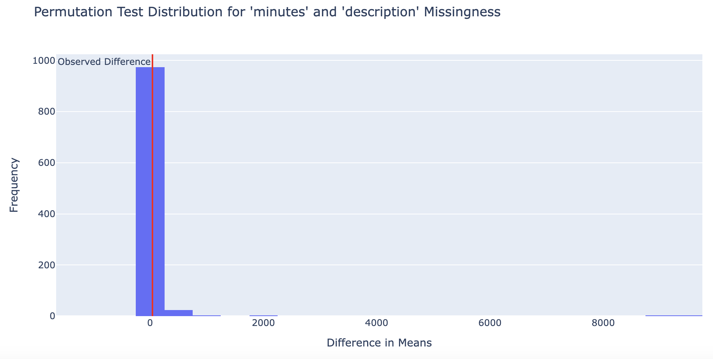
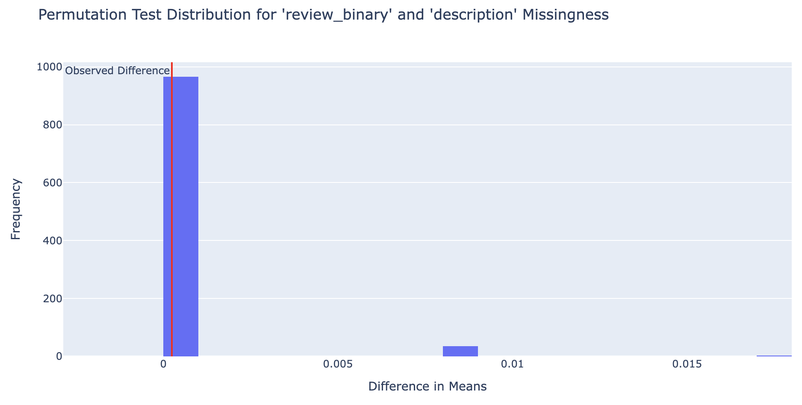

# Cooking Time Estimation Using Recipe Attributes

## Step 1: Introduction
Have you ever wondered how long a recipe will actually take to prepare, beyond the estimated time given? Our project is centered around the question: Can we accurately estimate the cooking time of a recipe in minutes based upon attributes of the recipe (ie. tags and number of steps in the recipe)? The dataset that we are using to answer this question is merged from two separate datasets—interactions.csv and RAW_recipes.csv. In the interactions.csv, it is a dataset that consists the date, the rating, and the review for each corresponding user ID and recipe ID. In the RAW_recipes.csv, it is a dataset that consists of the name of the dish, the id (which corresponds to the recipe ID in the interactions dataset), the minutes it takes to finish the recipe, the contributer ID (which corresponds to the user ID in the interactions dataset), submitted (which corresponds to the date in the interactions dataset), tags (words and phrases that describe the recipe), nutrition labels, number of steps, step-by-step description of how to make the recipe, the unique ingredients needed for each specific recipe and the number of ingredients needed overall. When merged together, this dataset contains various information about each recipe corresponding to each user ID. In this merged dataset that we are using, there are 234428 rows and 17 columns. The columns that we especially relevant to our question and analysis are: review, name, minutes, tags, n_steps, n_ingredients. 

Relevant Columns & Their Descriptions:
- Review (str): User feedback on the recipe
- Name (str): Name of the dish
- Minutes (int): Estimated cooking time in minutes
- Tags: List of descriptive tags for the recipe
- N_steps (int): Number of steps in the recipe
- N_ingredients (int): Total number of ingredients required
  
By analyzing these features, we aim to uncover patterns that influence cooking time and determine whether it can be accurately predicted. This information is particularly crucial for home cooks and meal planners who want better time estimates to manage their schedules efficiently. Understanding these factors could also help recipe websites provide more reliable cooking times for their users and viewers. 

## Step 2: Data Cleaning and Exploratory Data Analysis
- Data Cleaning: Describe, in detail, the data cleaning steps you took and how they affected your analyses. The steps should be explained in reference to the data generating process. Show the head of your cleaned DataFrame (see Part 2: Report for instructions).
- Univariate Analysis: Embed at least one plotly plot you created in your notebook that displays the distribution of a single column (see Part 2: Report for instructions). Include a 1-2 sentence explanation about your plot, making sure to describe and interpret any trends present. (Your notebook will likely have more visualizations than your website, and that’s fine. Feel free to embed more than one univariate visualization in your website if you’d like, but make sure that each embedded plot is accompanied by a description.)
- Bivariate Analysis: Embed at least one plotly plot that displays the relationship between two columns. Include a 1-2 sentence explanation about your plot, making sure to describe and interpret any trends present. (Your notebook will likely have more visualizations than your website, and that’s fine. Feel free to embed more than one bivariate visualization in your website if you’d like, but make sure that each embedded plot is accompanied by a description.)
- Interesting Aggregates: Embed at least one grouped table or pivot table in your website and explain its significance.

## Step 3: Assessment of Missingness
- NMAR Analysis: State whether you believe there is a column in your dataset that is NMAR. Explain your reasoning and any additional data you might want to obtain that could explain the missingness (thereby making it MAR). Make sure to explicitly use the term “NMAR.”
- Missingness Dependency: Present and interpret the results of your missingness permutation tests with respect to your data and question. Embed a plotly plot related to your missingness exploration; ideas include:• The distribution of column Y when column X is missing and the distribution of column Y when column X is not missing, as was done in Lecture 8.
- The empirical distribution of the test statistic used in one of your permutation tests, along with the observed statistic.
- 

## Step 4: Hypothesis Testing
After looking at the data, we noted that there were tags that related to cooking time. In this hypothesis testing we will be focusing on recipes belonging to these two tags: "60-minutes-or-less" tag amd "30-minutes-or-less"
- $H_0$: There is no difference mean minutes between these recipes from the two mentioned tags tags
- $H_A$: The mean minutes for "30-minutes-or-less" is significantly less than the mean minutes for "60-minutes-or-less"

Our test statistic will be the difference in mean minutes (not absolute difference because we predict the difference to be "less than" rather than "different to")

We will be performing a one-tailed permutation test, with N=10_000 and $\alpha$=0.05, to obtain a p-value which we will use to draw our conclusions

The p-value, 0.0, is less than our significance level 0.05, therefore we have sufficient evidence to reject the null and conclude that the recipes with the 30_minutes_or_less tag is very likely to have a mean that is significantly smaller than recipes with the tag 60_minutes_or_lessx

## Step 5: Framing a Prediction Problem
Clearly state your prediction problem and type (classification or regression). If you are building a classifier, make sure to state whether you are performing binary classification or multiclass classification. Report the response variable (i.e. the variable you are predicting) and why you chose it, the metric you are using to evaluate your model and why you chose it over other suitable metrics (e.g. accuracy vs. F1-score).

Note: Make sure to justify what information you would know at the “time of prediction” and to only train your model using those features. For instance, if we wanted to predict your final exam grade, we couldn’t use your Final Project grade, because the project is only due after the final exam! Feel free to ask questions if you’re not sure.

## Step 6: Baseline Model
Describe your model and state the features in your model, including how many are quantitative, ordinal, and nominal, and how you performed any necessary encodings. Report the performance of your model and whether or not you believe your current model is “good” and why.

Tip: Make sure to hit all of the points above: many projects in the past have lost points for not doing so.

## Step 7: Final Model
Final Model: State the features you added and why they are good for the data and prediction task. Note that you can’t simply state “these features improved my accuracy”, since you’d need to choose these features and fit a model before noticing that – instead, talk about why you believe these features improved your model’s performance from the perspective of the data generating process.

Describe the modeling algorithm you chose, the hyperparameters that ended up performing the best, and the method you used to select hyperparameters and your overall model. Describe how your Final Model’s performance is an improvement over your Baseline Model’s performance.

Optional: Include a visualization that describes your model’s performance, e.g. a confusion matrix, if applicable.

## Step 8: Fairness Analysis
Clearly state your choice of Group X and Group Y, your evaluation metric, your null and alternative hypotheses, your choice of test statistic and significance level, the resulting p-value, and your conclusion.
Optional: Embed a visualization related to your permutation test in your website.

