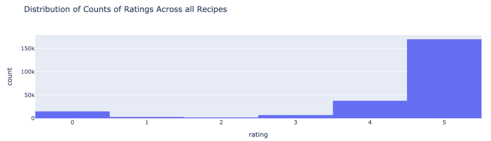
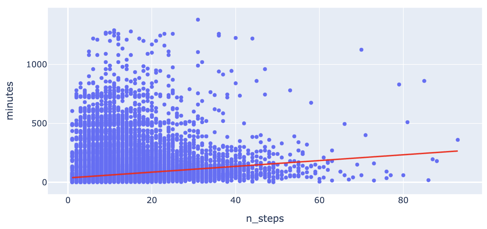
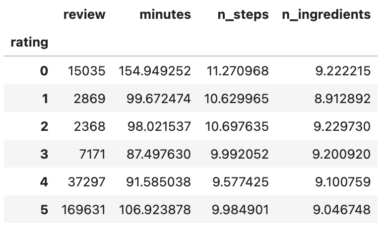
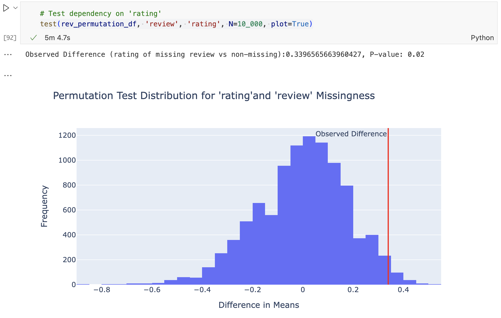
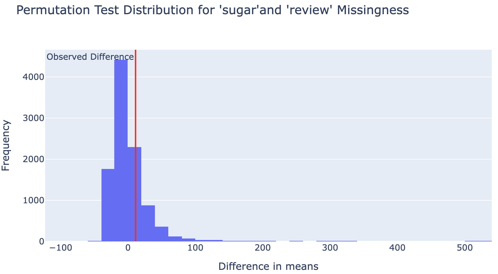
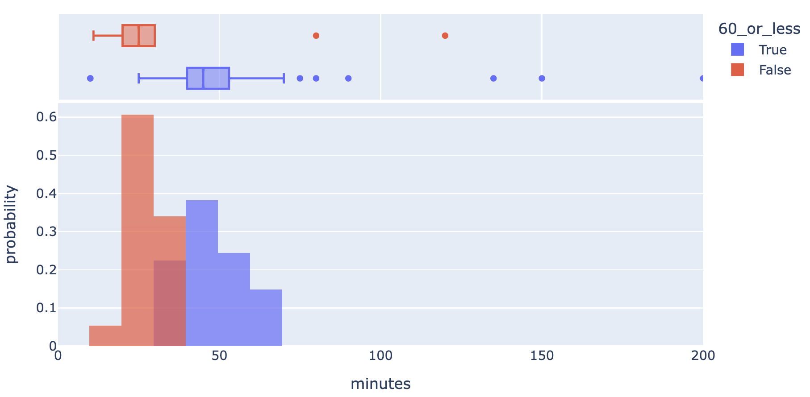

# Cooking Time Estimation Using Recipe Attributes

## Introduction
Have you ever wondered how long a recipe will actually take to prepare, beyond the estimated time given? Our project is centered around the question: Can we accurately estimate the cooking time of a recipe in minutes based upon attributes of the recipe (ie. tags and number of steps in the recipe)? The dataset that we are using to answer this question is merged from two separate datasets—interactions.csv and RAW_recipes.csv. In the interactions.csv, it is a dataset that consists the date, the rating, and the review for each corresponding user ID and recipe ID. In the RAW_recipes.csv, it is a dataset that consists of the name of the dish, the id (which corresponds to the recipe ID in the interactions dataset), the minutes it takes to finish the recipe, the contributer ID (which corresponds to the user ID in the interactions dataset), submitted (which corresponds to the date in the interactions dataset), tags (words and phrases that describe the recipe), nutrition labels, number of steps, step-by-step description of how to make the recipe, the unique ingredients needed for each specific recipe and the number of ingredients needed overall. When merged together, this dataset contains various information about each recipe corresponding to each user ID. In this merged dataset that we are using, there are 234428 rows and 17 columns. The columns that we especially relevant to our question and analysis are: review, name, minutes, tags, n_steps, n_ingredients. 

### Relevant Columns & Their Descriptions:
- Review (str): User feedback on the recipe
- Name (str): Name of the dish
- Minutes (int): Estimated cooking time in minutes
- Tags: List of descriptive tags for the recipe
- N_steps (int): Number of steps in the recipe
- N_ingredients (int): Total number of ingredients required
  
By analyzing these features, we aim to uncover patterns that influence cooking time and determine whether it can be accurately predicted. This information is particularly crucial for home cooks and meal planners who want better time estimates to manage their schedules efficiently. Understanding these factors could also help recipe websites provide more reliable cooking times for their users and viewers. 

## Data Cleaning and Exploratory Data Analysis
Data Cleaning Steps and Their Impact on Analysis
### Preparing Data
The data frames were merged recipe_id
A recipes_df was creating containing non duplicate recipe and replaced ratings with mean rating of that recipe
using .drop_duplicates(subset=[`recipe_id`], keep=`first`)
went back to reassign ratings with mean rating

### Data Type Corrections
Checked data types using .dtypes.
Approach: Converted incorrect data types (e.g., string of list to list, string to float) using astype().
`tags`, `steps`, and `ingredients` were converted from string to list of strings
`nutrition` was converted from string to list of floats
Impact: allowed easier manipulation in hypothesis testing and building our model.

### Handling Outliers
Detected outliers using boxplot to visualize distribution of `minutes`, the main focus of our model and hypothesis testing.
Approach: query to removed all recipes that took longer than a day (>1440 minutes)
After examining recipes that took longer than a day often include marinating or letting the ingredients rest for a certain period of time, which introduces significant right skew into the data
Impact: removed extreme values to make data less skewed.

This is what the first three rows of our dataframe looked like after cleaning

  <table style="width: 100%; border-collapse: collapse;">
    <thead>
      <tr>
        <th>Recipe ID</th>
        <th>Rating</th>
        <th>Review</th>
        <th>Name</th>
        <th>Minutes</th>
        <th>Tags</th>
        <th>Nutrition</th>
        <th>Steps Count</th>
        <th>Steps</th>
        <th>Description</th>
        <th>Ingredients</th>
        <th>Ingredient Count</th>
        <th>Calories</th>
        <th>Total Fat %DV</th>
        <th>Sugar %DV</th>
        <th>Sodium %DV</th>
        <th>Protein %DV</th>
        <th>Saturated Fat %DV</th>
        <th>Carbohydrates %DV</th>
      </tr>
    </thead>
    <tbody>
      <tr>
        <td>306785</td>
        <td>5</td>
        <td>Being a huge fan of America's Test Kitchen I...</td>
        <td>Spicy Nectarine and Corn Salsa</td>
        <td>40</td>
        <td>[60-minutes-or-less, time-to-make, course, main...]</td>
        <td>[5.3, 1.0, 50.0, 16.0, 5.0, 0.0, 7.0]</td>
        <td>4</td>
        <td>[in a medium bowl toss together nectarines c...]</td>
        <td>From my heroes at America's Test Kitchen (Cooks...)</td>
        <td>[nectarines, ear of corn, shallot, habanero pe...]</td>
        <td>8</td>
        <td>5.3</td>
        <td>1.0</td>
        <td>50.0</td>
        <td>16.0</td>
        <td>5.0</td>
        <td>0.0</td>
        <td>7.0</td>
      </tr>
      <tr>
        <td>310237</td>
        <td>5</td>
        <td>Wow! Red and white sweetness! DH loved them,...</td>
        <td>French Strawberry Crepes</td>
        <td>30</td>
        <td>[30-minutes-or-less, time-to-make, course, main...]</td>
        <td>[43.5, 5.0, 25.0, 3.0, 10.0, 3.0, 7.0]</td>
        <td>9</td>
        <td>[for the filling: toss the strawberries and br...]</td>
        <td>Yummy and sweet French-style strawberry breakf...</td>
        <td>[strawberries, brown sugar, cool whip free, fl...]</td>
        <td>10</td>
        <td>43.5</td>
        <td>5.0</td>
        <td>25.0</td>
        <td>3.0</td>
        <td>10.0</td>
        <td>3.0</td>
        <td>7.0</td>
      </tr>
      <tr>
        <td>321038</td>
        <td>5</td>
        <td>Being a healthy bar, this is very good. I make...</td>
        <td>HG's Grab 'n' Go Breakfast Cookies (Weight Wat...)</td>
        <td>22</td>
        <td>[30-minutes-or-less, time-to-make, course, prep...]</td>
        <td>[82.4, 2.0, 50.0, 7.0, 11.0, 1.0, 13.0]</td>
        <td>14</td>
        <td>[preheat oven to 375 degrees, chop raisins and...]</td>
        <td>I received a Hungry Girl email today and this ...</td>
        <td>[oats, whole wheat flour, fiber one cereal, sp...]</td>
        <td>14</td>
        <td>82.4</td>
        <td>2.0</td>
        <td>50.0</td>
        <td>7.0</td>
        <td>11.0</td>
        <td>1.0</td>
        <td>13.0</td>
      </tr>
    </tbody>
  </table>

### Univariate Analysis:

Distribution of `rating` column using histogram. `Ratings` is heavily left-skewed with the majority of the data values being `5`. This makes sense as people are more inclined to write a review when they have something strong to say.  

### Bivariate Analysis:

A scatter plot of `minutes` against `n_step` with a linear line of best fit. The data is right-skewed even after removing extreme values (recipes that take over 1440 minutes). There were a lot of data points for recipes with 30 steps or less.  

Re-plotting `minutes` against `n_steps`, but this time using the mean of minutes for each n_step value. This removes the clutter of duplicate values and shows the trendline more clearly. There appears to be a positive correlation between `n_steps` and average `minutes`,  but as n_steps gets larger the average minute varies more and further from the line-of-best-fit.

### Interesting Aggregates:
Below is a table representation of the pivot table that we created where we aggregated data from the original DataFrame by the rating column. For each unique rating value, it performs the following operations:

- Review Count (`review`): It calculates the count of entries for each rating, which represents how many reviews correspond to each rating.
- Mean Minutes (`minutes`): It calculates the average number of minutes associated with each rating.
- Mean Number of Steps (`n_steps`): It calculates the average number of steps for each rating.
- Mean Number of Ingredients (`n_ingredients`): It calculates the average number of ingredients for each rating.

This pivot table is significant because by aggregating the data on the `rating` column, we can observe that the most reviews are written for recipes with ratings of 5 or 0. On the other hand, when people have a more neutral opinion (e.g., a rating of 3), they possibly feel less inclined to leave a review since they don't feel strongly in any direction. When examining the mean values for `minutes`, `n_steps`, and `n_ingredients` (quantitative variables), we see that recipes with a rating of 0 took the longest to complete, followed by recipes with a rating of 5, and then the others. However, the ordering of `n_steps` didn’t align exactly with the ranking of `minutes` because while recipes with a rating of 0 had the most steps on average, recipes with a rating of 5 had the second least. Furthermore, the relationship between the number of ingredients and ratings doesn't show a clear pattern, making it less interesting for analysis.

## Assessment of Missingness
### Handling Missing Values
Identified missing values using .isnull().sum(). The following columns were found to have some missing values
- `reviews` is missing 57 values
- `name` is missing 1 value
- `description` is 114 values
- Approach: We kept all the missing values since we did not need to use those columns for any of our hypothesis testing and model building

### Assessing Missingness
- NMAR
    - We did not suspect any missingness to be NMAR.
- MAR
    - The `review` column undergone further analysis for missingness mechanism
        - We suspected that the missingness of `review` could be MAR dependent on `rating` as people with strong opinions, especially strong positive opinions are more inclined to write a review

After running a permutation test of 10,000 trials, we obtained a p-value of 0.02, which meant that the was a statistically significant difference in the distribution of ratings between where review is missing and where review is not missing.

 

We suspected that missingness of `review` is not related to sugar pdv (percent daily value) since the sweetness or healthy-ness of a recipe does not seem like it would affect whether or not a review was written

After running a permutation test of 10,000 trials, we obtained a p-value of 0.2272, which meant that the was not a statistically significant difference in the distribution of ratings between where review is missing and where review is not missing. 

## Hypothesis Testing
After looking at the data, we noted that there were tags that related to cooking time. In this hypothesis testing we will be focusing on recipes belonging to these two tags: "60-minutes-or-less" tag amd "30-minutes-or-less"
- $H_0$: There is no difference mean minutes between these recipes from the two mentioned tags tags
- $H_A$: The mean minutes for "30-minutes-or-less" is significantly less than the mean minutes for "60-minutes-or-less"

Our test statistic will be the difference in mean minutes (not absolute difference because we predict the difference to be "less than" rather than "different to")

We will be performing a one-tailed permutation test, with N=10_000 and $\alpha$=0.05, to obtain a p-value which we will use to draw our conclusions

The p-value, 0.0, is less than our significance level 0.05, therefore we have sufficient evidence to reject the null and conclude that the recipes with the 30_minutes_or_less tag is very likely to have a mean that is significantly smaller than recipes with the tag 60_minutes_or_lessx

## Framing a Prediction Problem
Our prediction problem of estimating the time (minutes) it takes to complete a recipe using attributes of the recipe such as `n_steps`, `n_ingredients`, and type of ingredients would be a regression problem. This is because ultimately, we are trying to predict time in minutes, which is a continuous quantitative variable. Regression models predict continuous numerical values, whereas classification models are better at predicting discrete categorical variables (ie. categories or labels such as ‘long time’, ‘medium time’, ‘short time’). Our response variable is the number of minutes it takes to complete a recipe, and we chose this because we understand that everyone’s time is of value and to those who may be on a tight time crunch but still want to bake or cook, being able to accurately estimate the minutes is crucial in their time management. The metric that we are using to evaluate our model is using the MAE (mean absolute error). We chose this over other suitable metrics because when we use the MAE, it treats all errors equally by taking the absolute difference between predicted and actual values. This makes it more robust against outliers in the data. Additionally, MAE can be interpreted directly in the same units of time (minutes), which allows us to provide a clear and interpretable error in terms of minutes. This makes it easier to understand how much variability people should expect in the estimated cooking time when using our model. 

At the “time of prediction”, we would know the number of steps in the recipe, the ingredients needed for the recipe, as well as the number of ingredients in the recipe, which will also be the features that we train our model on. Features of the recipe such as review and rating are only known after actually cooking and making the recipe so we won’t be using them within our model as parameters when estimating the time it takes to complete the recipe. 

## Baseline Model
Our baseline model is a linear regression model fit using 2+7 quantitative columns,  `n_steps` column, the `n_ingredients` column, and we engineered the `nutrition` column, into 7 separate columns (`calories`, `total fat pdv`, `sugar pdv`, `sodium pdv`, `protein pdv`, `saturated fat pdv`, `carbohydrates pdv`), each representing a value from the nutrition column.

### Transformations
We trained 3 different linear regression models with the same columns that have undergone slightly different transformations. 
<table>
  <thead>
    <tr>
      <th>Transformation</th>
      <th>Train RMSE</th>
      <th>Train MAE</th>
      <th>Test RMSE</th>
      <th>Test MAE</th>
    </tr>
  </thead>
  <tbody>
    <tr>
      <td>No transformation</td>
      <td>1826.15</td>
      <td>122.31</td>
      <td>5120.09</td>
      <td>140.93</td>
    </tr>
    <tr>
      <td>Only transform n_step, n_ingredients</td>
      <td>1826.65</td>
      <td>123.95</td>
      <td>5120.02</td>
      <td>142.90</td>
    </tr>
    <tr>
      <td>All columns transformed</td>
      <td>1825.65</td>
      <td>127.79</td>
      <td>5120.19</td>
      <td>146.27</td>
    </tr>
  </tbody>
</table>

We chose the model using no transformation as our baseline model, as it performed best with unseen data and seen (lowest test MAE and lowest train MAE, our main metric for accuracy) out of all three models. We suspect this may be due to the fact that there is a fairly linear relationship between `n_steps`, `n_ingredients`, and `minutes`

### Model features
- Quantitative features
    - `n_steps`: no processing needed
    - `n_ingredients`: no processing needed
- Other types of features
    - `nutrition`: split into respective macronutrient groups
        - Each macronutrient column is a quantitative continuous feature after splitting
- No ordinal and nominal categories

### Model Performance 
We believe that that model can still improve. The current model is nor performing the best, as it has a high MAE. The current model has a MAE of around 122 when performing with trained data, and it has a MAE of around 141 when applied to unseen data (test data). This is an average error of up to 2 hours from the actual `minutes` and that is a pretty big margin of error.

## Final Model
In our final model, we introduced two new features: one-hot encoding of the top 50 most common ingredients and one-hot encoding of time-related recipe tags. The ingredient encoding created 50 new columns, where each recipe received a 1 if it contained a given ingredient and 0 otherwise. This feature is beneficial because ingredient composition strongly correlates with cooking time. For example, recipes with rice generally require more preparation time than those with cheese. By incorporating ingredient-based patterns, our model can better predict cooking durations.
Additionally, we encoded time-related recipe tags, such as "30-minutes-or-less" and "one-day-or-more," to capture general cooking time categories. These tags provide a broad estimate of whether a recipe is quick, moderate, or slow to prepare. Cooking time is influenced not only by the ingredients used but also by implicit preparation steps, which these tags summarize. By adding this feature, our model gains a higher-level understanding of time-based structuring in recipe data.
Both of these features align well with the data-generating process of recipes, where cooking duration depends on ingredient composition and preparation steps. Instead of relying purely on numerical or textual inputs, our model now leverages categorical relationships that enhance its predictive capabilities.
To determine the best-performing model, we experimented with multiple regression approaches, including Linear Regression, Ridge Regression, and Lasso Regression. However, after evaluating performance, we found that Decision Tree Regression yielded the most accurate predictions. Decision trees are particularly effective for this task because they can capture complex, non-linear relationships between ingredients, time-related tags, and cooking duration.

To further optimize our Decision Tree model, we performed hyperparameter tuning and also added the two features that we one-hot encoded. After testing various configurations, the following hyperparameters produced the best results:
max_depth = 45
min_samples_leaf = 1
min_samples_split = 3
These values were selected based on iterative testing, where we minimized Mean Absolute Error (MAE) on both the training and test datasets. The tuning process helped balance the trade-off between model complexity and generalization to new data.
The final model that we ended up implementing which performed with a higher accuracy is using Decision Tree Regression where we were able to achieve the highest accuracy in terms of MAE (mean absolute error) score. We used the best hyperparameters in our final model to further optimize its performance. Our final model's performance using Decision Tree Regression is an improvement over our baseline model's performance using Linear Regression because when comparing the accuracy metrics, the final model had a significantly lower MAE value. Initially, in the linear regression model, the MAE = 122.31 for the train_df and the MAE = 140.93 for the test_df. However, using the decision tree regressor (without hypertuning first), we got an MAE = 62.38 for the train_df and MAE = 99.09 for the test_df. After tuning certain hyperparameters used in the decision tree regressor model (max_depth, min_samples_leaf, and min_samples_split) and also adding two new features—one-hot encoding the top 50 most common ingredients and one-hot encoding time-related recipe tags, we predicted the MAE again on the same train_df and test_df, and got a MAE value of 6.34 and 45.15 respectively, which is significantly better than both the decision tree regressor without hyperparameter tuning and the baseline linear regression model that we initially wrote. 

<table>
  <tr>
    <th>Model</th>
    <th>Train MAE</th>
    <th>Test MAE</th>
  </tr>
  <tr>
    <td><strong>Baseline (Linear Regression)</strong></td>
    <td>122.31</td>
    <td>140.93</td>
  </tr>
  <tr>
    <td><strong>Decision Tree (no tuning)</strong></td>
    <td>62.38</td>
    <td>99.09</td>
  </tr>
  <tr>
    <td><strong>Decision Tree (tuned, with new features)</strong></td>
    <td><strong>6.34</strong></td>
    <td><strong>45.15</strong></td>
  </tr>
</table>

This indicated that this model was better at predicting the time for a recipe (in minutes) given the almost the same input features. Additionally, we specifically decided to use MAE over other accuracy metrics (ie. MSE and R-Squared) because MAE is easier to understand as it is in the same units as what we are trying to predict (time in minutes) and is also more robust to outliers. 

By carefully choosing relevant features, selecting an appropriate modeling approach, and fine-tuning hyperparameters, we successfully improved our model’s ability to predict cooking times. Our final Decision Tree Regression model demonstrates a significant performance gain over the baseline, providing a more reliable tool for estimating recipe durations.

## Fairness Analysis
Clearly state your choice of Group X and Group Y, your evaluation metric, your null and alternative hypotheses, your choice of test statistic and significance level, the resulting p-value, and your conclusion.
Optional: Embed a visualization related to your permutation test in your website.

