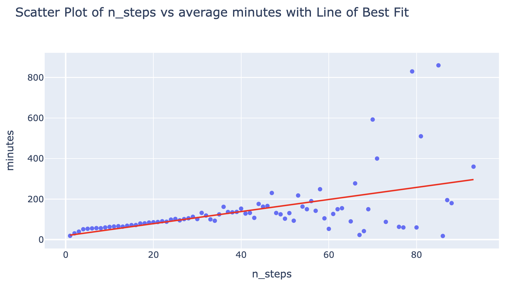

# Cooking Time Estimation Using Recipe Attributes

## Introduction
Have you ever wondered how long a recipe will actually take to prepare, beyond the estimated time given? Our project is centered around the question: Can we accurately estimate the cooking time of a recipe in minutes based upon attributes of the recipe (ie. tags and number of steps in the recipe)? The dataset that we are using to answer this question is merged from two separate datasets—interactions.csv and RAW_recipes.csv. In the interactions.csv, it is a dataset that consists the date, the rating, and the review for each corresponding user ID and recipe ID. In the RAW_recipes.csv, it is a dataset that consists of the name of the dish, the id (which corresponds to the recipe ID in the interactions dataset), the minutes it takes to finish the recipe, the contributer ID (which corresponds to the user ID in the interactions dataset), submitted (which corresponds to the date in the interactions dataset), tags (words and phrases that describe the recipe), nutrition labels, number of steps, step-by-step description of how to make the recipe, the unique ingredients needed for each specific recipe and the number of ingredients needed overall. When merged together, this dataset contains various information about each recipe corresponding to each user ID. In this merged dataset that we are using, there are 234428 rows and 17 columns. The columns that we especially relevant to our question and analysis are: review, name, minutes, tags, n_steps, n_ingredients. 

### Relevant Columns & Their Descriptions:
- Review (str): User feedback on the recipe
- Name (str): Name of the dish
- Minutes (int): Estimated cooking time in minutes
- Tags: List of descriptive tags for the recipe
- N_steps (int): Number of steps in the recipe
- N_ingredients (int): Total number of ingredients required
  
By analyzing these features, we aim to uncover patterns that influence cooking time and determine whether it can be accurately predicted. This information is particularly crucial for home cooks and meal planners who want better time estimates to manage their schedules efficiently. Understanding these factors could also help recipe websites provide more reliable cooking times for their users and viewers. 

## Data Cleaning and Exploratory Data Analysis
Data Cleaning Steps and Their Impact on Analysis
### Preparing Data
The data frames were merged recipe_id
A recipes_df was creating containing non duplicate recipe and replaced ratings with mean rating of that recipe
using .drop_duplicates(subset=[`recipe_id`], keep=`first`)
went back to reassign ratings with mean rating

### Data Type Corrections
Checked data types using .dtypes.
Approach: Converted incorrect data types (e.g., string of list to list, string to float) using astype().
`tags`, `steps`, and `ingredients` were converted from string to list of strings
`nutrition` was converted from string to list of floats
Impact: allowed easier manipulation in hypothesis testing and building our model.

### Handling Outliers
Detected outliers using boxplot to visualize distribution of `minutes`, the main focus of our model and hypothesis testing.
Approach: query to removed all recipes that took longer than a day (>1440 minutes)
After examining recipes that took longer than a day often include marinating or letting the ingredients rest for a certain period of time, which introduces significant right skew into the data
Impact: removed extreme values to make data less skewed.

### Univariate Analysis:

Distribution of `rating` column using histogram. `Ratings` is heavily left-skewed with the majority of the data values being `5`. This makes sense as people are more inclined to write a review when they have something strong to say.  

### Bivariate Analysis:

A scatter plot of `minutes` against `n_step` with a linear line of best fit. The data is right-skewed even after removing extreme values (recipes that take over 1440 minutes). There were a lot of data points for recipes with 30 steps or less.  

Re-plotting `minutes` against `n_steps`, but this time using the mean of minutes for each n_step value. This removes the clutter of duplicate values and shows the trendline more clearly. There appears to be a positive correlation between `n_steps` and average `minutes`,  but as n_steps gets larger the average minute varies more and further from the line-of-best-fit.

- Interesting Aggregates: Embed at least one grouped table or pivot table in your website and explain its significance.

## Assessment of Missingness
- NMAR Analysis: State whether you believe there is a column in your dataset that is NMAR. Explain your reasoning and any additional data you might want to obtain that could explain the missingness (thereby making it MAR). Make sure to explicitly use the term “NMAR.”
- Missingness Dependency: Present and interpret the results of your missingness permutation tests with respect to your data and question. Embed a plotly plot related to your missingness exploration; ideas include:• The distribution of column Y when column X is missing and the distribution of column Y when column X is not missing, as was done in Lecture 8.
- The empirical distribution of the test statistic used in one of your permutation tests, along with the observed statistic.

## Hypothesis Testing
After looking at the data, we noted that there were tags that related to cooking time. In this hypothesis testing we will be focusing on recipes belonging to these two tags: "60-minutes-or-less" tag amd "30-minutes-or-less"
- $H_0$: There is no difference mean minutes between these recipes from the two mentioned tags tags
- $H_A$: The mean minutes for "30-minutes-or-less" is significantly less than the mean minutes for "60-minutes-or-less"

Our test statistic will be the difference in mean minutes (not absolute difference because we predict the difference to be "less than" rather than "different to")

We will be performing a one-tailed permutation test, with N=10_000 and $\alpha$=0.05, to obtain a p-value which we will use to draw our conclusions

The p-value, 0.0, is less than our significance level 0.05, therefore we have sufficient evidence to reject the null and conclude that the recipes with the 30_minutes_or_less tag is very likely to have a mean that is significantly smaller than recipes with the tag 60_minutes_or_lessx

## Framing a Prediction Problem
Our prediction problem of estimating the time (minutes) it takes to complete a recipe using attributes of the recipe such as n_steps, n_ingredients, and type of ingredients would be a regression problem. This is because ultimately, we are trying to predict time in minutes, which is a continuous quantitative variable. Regression models predict continuous numerical values, whereas classification models are better at predicting discrete categorical variables (ie. categories or labels such as ‘long time’, ‘medium time’, ‘short time’). Our response variable is the number of minutes it takes to complete a recipe, and we chose this because we understand that everyone’s time is of value and to those who may be on a tight time crunch but still want to bake or cook, being able to accurately estimate the minutes is crucial in their time management. The metric that we are using to evaluate our model is using the MAE (mean absolute error). We chose this over other suitable metrics because when we use the MAE, it treats all errors equally by taking the absolute difference between predicted and actual values. This makes it more robust against outliers in the data. Additionally, MAE can be interpreted directly in the same units of time (minutes), which allows us to provide a clear and interpretable error in terms of minutes. This makes it easier to understand how much variability people should expect in the estimated cooking time when using our model. 

At the “time of prediction”, we would know the number of steps in the recipe, the ingredients needed for the recipe, as well as the number of ingredients in the recipe, which will also be the features that we train our model on. Features of the recipe such as review and rating are only known after actually cooking and making the recipe so we won’t be using them within our model as parameters when estimating the time it takes to complete the recipe. 

## Baseline Model
Our baseline model is a linear regression model fit using 2+7 quantitative columns,  `n_steps` column, the `n_ingredients` column, and we engineered the `nutrition` column, into 7 separate columns (`calories`, `total fat pdv`, `sugar pdv`, `sodium pdv`, `protein pdv`, `saturated fat pdv`, `carbohydrates pdv`), each representing a value from the nutrition column.

### Transformations
We trained 3 different linear regression models with the same columns that have undergone slightly different transformations. 
|transformation                      |train RMSE|train MAE|test RMSE|test MAE|
|------------------------------------|----------|---------|---------|--------|
|no transformation                   | 1826.15  | 122.31  | 5120.09 | 140.93 |
|only transform n_step, n_ingredients| 1826.65  | 123.95  | 5120.02 | 142.90 |
|all columns transformed             | 1825.65  | 127.79  | 5120.19 | 146.27 |

We chose the model using no transformation as our baseline model, as it performed best with unseen data and seen (lowest test MAE and lowest train MAE, our main metric for accuracy) out of all three models. We suspect this may be due to the fact that there is a fairly linear relationship between `n_steps`, `n_ingredients`, and `minutes`

### Model features
- Quantitative features
    - n_steps: no processing needed
    - n_ingredients: no processing needed
- Other types of features
    - nutrition: split into respective macronutrient groups
        - Each macronutrient column is a quantitative continuous feature after splitting
- No ordinal and nominal categories

### Model Performance 
We believe that that model can still improve. The current model is nor performing the best, as it has a high MAE. The current model has a MAE of around 122 when performing with trained data, and it has a MAE of around 141 when applied to unseen data (test data). This is an average error of up to 2 hours from the actual `minutes` and that is a pretty big margin of error.

## Final Model
Final Model: State the features you added and why they are good for the data and prediction task. Note that you can’t simply state “these features improved my accuracy”, since you’d need to choose these features and fit a model before noticing that – instead, talk about why you believe these features improved your model’s performance from the perspective of the data generating process.

Describe the modeling algorithm you chose, the hyperparameters that ended up performing the best, and the method you used to select hyperparameters and your overall model. Describe how your Final Model’s performance is an improvement over your Baseline Model’s performance.

Optional: Include a visualization that describes your model’s performance, e.g. a confusion matrix, if applicable.

## Fairness Analysis
Clearly state your choice of Group X and Group Y, your evaluation metric, your null and alternative hypotheses, your choice of test statistic and significance level, the resulting p-value, and your conclusion.
Optional: Embed a visualization related to your permutation test in your website.

